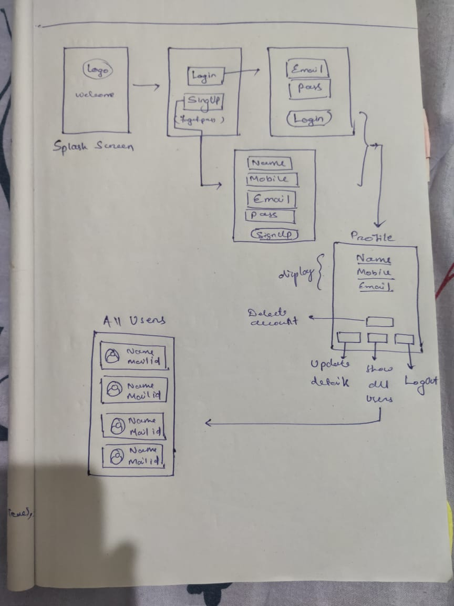

# Task

**Build a login application with firebase**. 
 
The app must have following features:- 

<ol>

<li>Username & password login.</li>
<li>Splash screen.</li>
<li>SignUp page.</li>
<li>SignIn page</li>
<li>Profile Page after logging in.</li>
<li>Profile Page must have following buttons and functionalities.

  <ol>
  <li>Delete Account.</li>
  <li>Update details.</li>
  <li>Logout button.</li>
  <li>All users button accessing to all users details using that app.</li>
  </ol>

  </li>
<li>All users screen (Display all users with name and mail id only).</li>
<li>Signin Page must contain forget password button.</li>

</ol> 

# Task Overview

